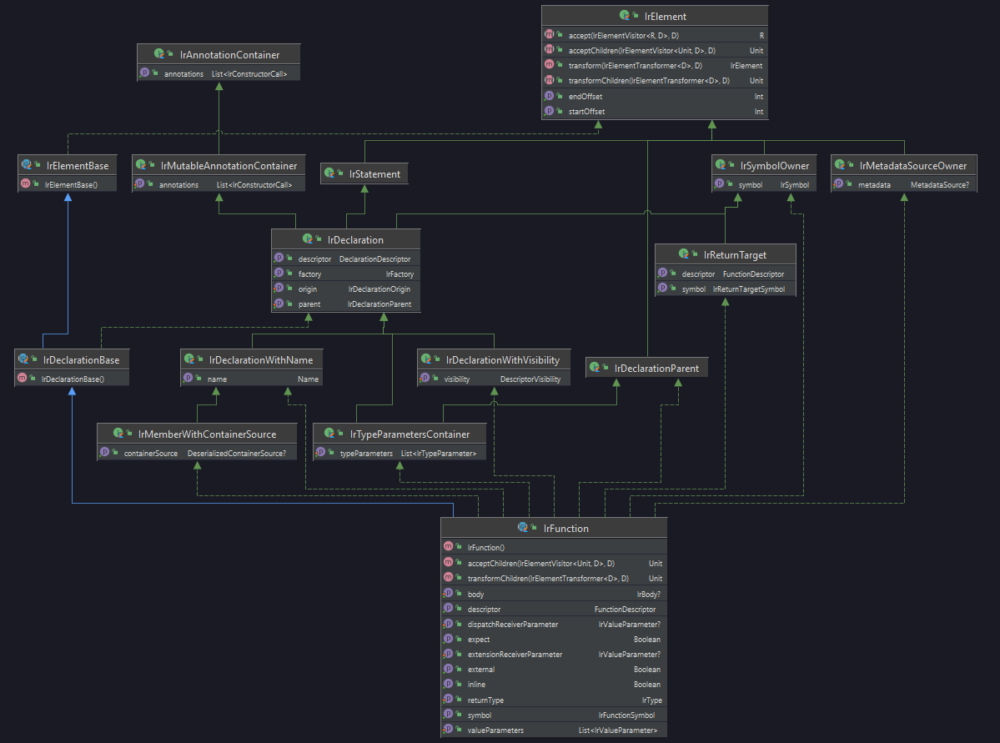

# DSL for Optimization framework

Цель: описать DSL для фреймворка оптимизаций
Что должен уметь ФО:
- Описать и найти кусок кода на котором можно применить оптимизацию(трансформацию)
- Описать новый код для вставки/замены
- Описать куда или вместо чего будет вставлен новый код

## DSL

### Матчер

#### Основная идея

Идея основывается на матчерах из пакета [`org.jetbrains.kotlin.backend.common.lower.matchers`](../lower/matchers)

Создать иерархию матчеров которые умеют матчить свой Ir.

Например, для `IrDeclaration` можно проверить `matchOrigin` и `matchParent`, и тогда для `IrFunction: IrDeclaraion` можно будет
использовать `matchOrigin` и `matchParent`.



#### Пример

```Kotlin
matchFile {
    matchClass {
        matchClassKind { it == ClassKind.INTERFACE }
        isCompanion()
        isInner()
        isData()
        isExternal()
        isInline()
        isExpect()
        isFun()
        matchSuperTypes { }
        matchThisReceiver { }
        // и т.д.

        // Проматчить тело класса. Пока не понятно как лучше сделать
        //      Можно утвердить что внутри блока `matchClass` важен порядок и использовать констуркции вида
        //      `matchConstructor` `matchProperty` `matchFunction` `matchCompanion` `anything`
        matchDeclaration { // from IrDeclaration
            // TODO   
        }
        matchFuntion {
            isInline()
            isExternal()
            isExpect()
            matchReturnType { }
            matchDispatchReceiverParameter { }
            matchExtensionReceiverParameter { }
            // TODO
        }
    }
}
```

### Новый код

Скорее всего уже существующий `IrBuilder` отлично справиться с этой задачей.

### Трансформация

#### 1

Можно было бы описывать новый код прямо после кода который нужно заменить.

Плюсы:

* Просто в реализации т.к. почти всё что может понадобиться для создания нового кода находится в скоупе(ссылка на класс, параметры функции и
  т.д.)

Минусы:

* Может выглядеть запутанно
* Возможно не интуитивно. Функция замены будет находиться где-то в середине матчинга, хотя на самом деле она выполнится только если весь
  матчинг выполнился

##### 1.1

```Kotlin
matchClass {
    matchFunction {

    } replaceWith getNewFunction(this@IrClass)
}
```

где

```Kotlin
infix fun Matcher.replaceWith(newElement: IrElement) {
    TODO()
}

fun getNewFunction(clazz: IrClass, f: IrFunction): IrFunction {
    TODO()
}
```

#### 1.2

```Kotlin
matchClass {
    matchFunction {
        TODO()
    } replaceWith<IrFunction> { getNewFun(this@IrClass, this) }
}
```

где

```Kotlin
fun <F, T> Matcher<F>.replaceWith(generateNewElement: F.() -> T) {
    TODO()
}

fun getNewFunction(clazz: IrClass, f: IrFunction): IrFunction {
    TODO()
}
```

#### 2

На этапе матчинга можно оставлять именованные метки

Плюсы:

*

Минусы:

* Теряется информация о типах
* Как сообщать об ошибках?

```Kotlin
matchClass {
    matchFunction {
        TODO()
    } mark("f", ReplaceContext(this@IrClass))
}
```

Далее где-то...

```Kotlin
replace("f") { context: ReplaceContext ->
    TODO()
}
```

где `mark` и `replace` со следующими сигнатурами

```Kotlin
fun <F> Matcher<F>.mark(id: String, context: ReplaceContext) {
    context.add(this.ir)
    TODO()
}

fun replace(id: String, newElement: (ReplaceContext) -> IrElement) {
    TODO()
}
```

## Проблемы

* Все оптимизации написаны с использованием `IrElementVisitor`. Это позволяет легко находить места типа `call`, `getField`. Как реализовать
  подобный функционал в матчере?

* Огромное количество дублирования. Для того чтобы понять можно ли применить оптимизацию производится большое количество проверок. Очень
  часто это цепочка проверок где на каждом этапе появляется новый элемент и следующая проверка происходит уже над ними. Есть ощущение что
  матчерами такого поведения не добиться. Пример:
  ```kotlin
  val function = (expression.symbol.owner as? IrSimpleFunction) ?: return super.visitCall(expression)
  val property = function.correspondingPropertySymbol?.owner ?: return super.visitCall(expression)
  return expression.lowerConstRead(expression.dispatchReceiver, property.backingField) ?: super.visitCall(expression)
  ```

## Примеры

### [ConstLowering](./lower.md)

```kotlin
matchGetField {
    matchOwner { it.constantValue() != null }
} replaceWith { lowerConstRead(receiver, symbol.owner) }

matchCall {
    matchOwner { it is IrSimpleFunction }
    TODO()
}
```